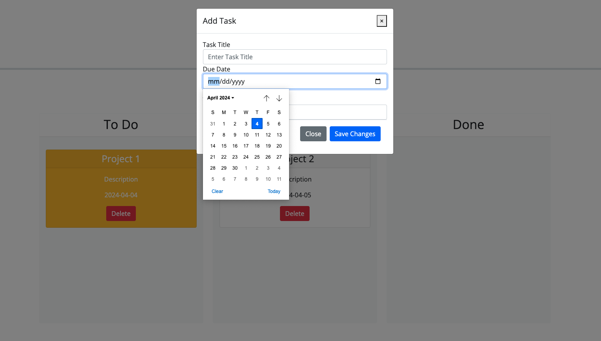

# Task Board 3rd Party APIs
A dynamic webpage powered by jQuery.  

## Introduction 
- This project was created to develop a task board that displays the status and due date of tasks. This webpage is powered by jQuery, JavaScript, HTML, Bootstrap, and CSS. 

## Technologies applied 
- JavaScript 
- jQuery 
- Bootstrap 
- HTML 
- CSS

## Launch 
- Navigate to webpage: https://jovanna24.github.io/task-board_3rd_party_APIs/ 
- Access the project repo: https://github.com/jovanna24/task-board_3rd_party_APIs.git 

## Illustrations 

## Authors 
- Jovanna Jimenez 
-- GitHub Repo:  https://github.com/jovanna24 
## Acknowledgments 
- Starter Code 
- Student Mini Project: Project Tracker 
- GitHub README Template: https://everhour.com/blog/github-readme-template/ 
- BCS Tutoring Services 
